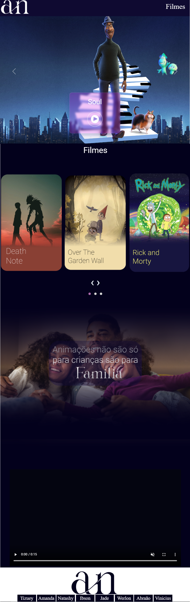

<h2>AnimeFlix🎥 </h2>

Este é um projeto  realizado no curso Certified Tech Developer da  <a href="https://www.digitalhouse.com/br/">**Digital House❤**</a>.                                          AnimeFlix é uma aplicação web de streaming de filmes e séries em desenho. 

------

<h2>📌O que foi feito aqui?</h2>

O projeto contém página de login, home, filmes e série.                                                                                                 Além disso, conta com efeitos de carrossel hover e paralaxe.    

------

<h2>Softwares e linguagens usados 💾<h2>  

###     

------

<h2>Desenvolvedores</h2> 

<h2>👨‍💻Abraão     
     </h2>

<h2>👩‍💻Amanda
     </h2>

<h2>👨‍💻Ibson
     </h2>

<h2>👩‍💻Jade
     </h2>

<h2>👩‍💻Júlia
     </h2>

<h2>👩‍💻Natashy
     </h2>

<h2>👨‍💻Vinícius
     </h2>

<h2>👨‍💻Werlon
    </h2>

